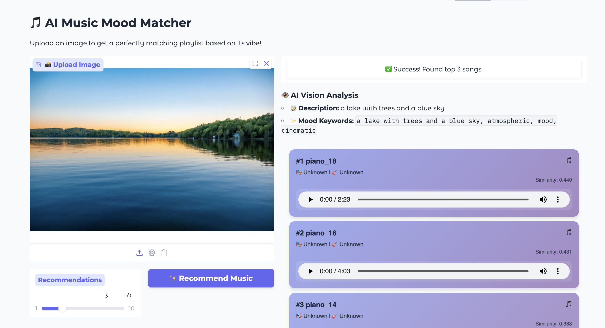

# 🎵 Cross Modal Music Recommender

**AI-Powered Music Recommendation System Based on Image Mood Analysis**

[](https://www.python.org/)
[](https://pytorch.org/)
[](https://gradio.app/)

## 📖 Overview

An intelligent music recommendation system that analyzes the emotional atmosphere of images using multimodal AI and recommends a music based on it.

## 🎯 Key Features

#### 🔧 Music Database Building (Setup)
- **Music Vectorization**: Convert audio files to 512-dimensional embeddings using CLAP
- **Vector Database**: Pre-compute and store music embeddings for fast retrieval
- **Metadata Management**: Organize tracks with title, mood, and genre tags
- **Easy Addition**: Add new music files -> rebuild database

#### 🚀 Music Recommendation (Real-time)
- **Image Analysis**: Automatic image understanding using BLIP
- **Text Enhancement**: Augment captions with mood-related keywords
- **Multimodal Matching**: Cross-modal embedding with CLAP (Text Encoder)
- **Vector Search**: Cosine similarity-based retrieval
- **Interactive UI**: Simply web interface built with Gradio
- **Instant Preview**: Real-time audio playback of recommended tracks

## 🛠️ Technology Stack

### AI/ML Framework
- **PyTorch** - Deep learning framework
- **Transformers** (Hugging Face) - Pre-trained model hub
- **BLIP** (Salesforce) - Bootstrapping Language-Image Pre-training
- **CLAP** (LAION) - Contrastive Language-Audio Pre-training

### Audio Processing
- **librosa** - Audio analysis and feature extraction

### Web Framework
- **Gradio** - Rapid UI development for ML models

## 🚀 Quick Start

### Prerequisites

```bash
Python 3.9+
pip
```

### Installation

```bash
# Clone the repository
git clone https://github.com/choi8616/cross_modal_music_recommender.git
cd music-mood-analyzer

# Install dependencies
pip install -r requirements.txt
```

### Running the Application

#### Web UI (Recommended)

Link: https://huggingface.co/spaces/dayunsom/Image_to_music_recommender

If the link doesn't work, manually open up the host
```bash
python app.py
```
Then open your browser and navigate to `http://localhost:7860`

#### CLI Interface

```bash
# Basic usage
python recommend.py path/to/image.jpg

# Get top 10 recommendations
python recommend.py path/to/image.jpg --topk 10

# Auto-play the top result (macOS only)
python recommend.py path/to/image.jpg --play
```

#### 📦 Adding New Music

```bash
# 1. Place audio files in new_music/
cp your_song.mp3 new_music/

# 2. Rebuild the database
python music_to_vector.py

# 3. Restart the app
python app.py
```

#### 🧪 Testing

```bash
# Test with sample images
python recommend.py test_images/sunset.jpg
python recommend.py test_images/forest.jpg
python recommend.py test_images/city.jpg
```

## 📂 Project Structure

```
cross_modal_music_recommender/
├── app.py                          # Gradio web interface (main)
├── recommend.py                    # CLI interface
├── image_to_vector.py              # Image → Vector conversion
├── music_to_vector.py              # Audio → Vector & DB constructor
├── music_database.npy              # Vector database (N, 512)
├── music_database_metadata.json    # Metadata (title, mood, genre)
├── processed_music/                # Processed audio files
│   ├── game_1.mp3
│   ├── lofi_1.mp3
│   └── ...
├── new_music/                      # New music to be converted
├── requirements.txt
└── README.md
```

## 🧠 Workflow

### Pipeline Architecture

```
┌─────────────────┐
│   Input Image   │  (e.g., sunset.jpg)
└────────┬────────┘
         ↓
┌─────────────────────────────────┐
│  BLIP Image Captioning          │
│  Output: "a sunset over ocean"  │
└────────┬────────────────────────┘
         ↓
┌─────────────────────────────────┐
│  Text Enhancement               │
│  + ", atmospheric, mood, ..."   │
└────────┬────────────────────────┘
         ↓
┌─────────────────────────────────┐
│  CLAP Text Encoder              │
│  Output: [0.23, -0.45, ...]     │  (512-dim embedding)
└────────┬────────────────────────┘
         ↓
┌─────────────────────────────────┐
│  Cosine Similarity Search       │
│  Compare with Music Database    │
└────────┬────────────────────────┘
         ↓
┌─────────────────────────────────┐
│  Top-K Results                  │
│  1. lofi_1.mp3    (0.8234)      │
│  2. piano_2.mp3   (0.7891)      │
│  3. house_1.mp3   (0.7654)      │
│  ...                            │
└─────────────────────────────────┘
```

## 📊 Performance

- **Inference Speed**: ~3 seconds (CPU)
- **Music Database Size**: 100 tracks
- **Embedding Dimension**: 512
- **Similarity Metric**: Cosine Similarity

## 📸 Screenshots

### Main Interface


### Recommendation Results


## ⚠️ Limitations

- Currently, the music database contains about 100 curated tracks; diversity is limited.
- Mood estimation is based on a single image caption and simple text enhancement.

## 🔭 Future Work

- Expand the music database with more diverse genres and moods.
- Add user feedback loop to adapt recommendations.
- Explore more advanced text-image-audio alignment models.(Enhance similarity rates)


## 👤 Author

**Yonghyeon Choi**
- GitHub: https://github.com/choi8616?tab=repositories
- LinkedIn: https://www.linkedin.com/in/yonghyeon-choi-45264133a/
- Email: choidrgn@gmail.com

**Donghyun Han**
- GitHub:
- LinkedIn: 
- Email: